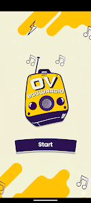
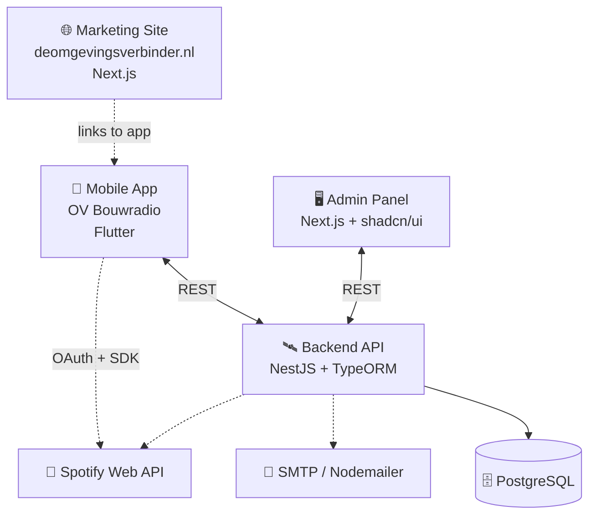

<div align="center">

# 🎵 OV Bouwradio

### _Scan. Listen. Guess._

**The music game on the construction site — one tap away.**

A real‑time QR‑powered music guessing game built with **Flutter**, **NestJS** and **Next.js** — turning physical game cards into a Spotify‑backed party on the build.

---

<a href="https://deomgevingsverbinder.nl/"></a>
<a href="https://play.google.com/store/apps/details?id=com.omgevingsverbinder.vlietsonhitstar"></a>

---


</div>

---

## 📸 App Preview

<div align="center">

|             🟡 Splash & Start              |      📖 First‑time Playing      |     🎧 Connect Spotify Premium     |
| :----------------------------------------: | :-----------------------------: | :--------------------------------: |
|                     |    |  |
| _Tap Start, meet the OV Bouwradio mascot._ | _Read how the card game works._ | _Hook up Premium for full tracks._ |

</div>

---

## ⬇️ Download the App

<div align="center">

<a href="https://play.google.com/store/apps/details?id=com.omgevingsverbinder.vlietsonhitstar">
  
</a>

<br/>

📦 **Package:** `com.omgevingsverbinder.vlietsonhitstar` &nbsp;·&nbsp; 🤖 **Requires:** Android 5.0+ (API 21+)

<br/>

[**👉 Install OV Bouwradio now**](https://play.google.com/store/apps/details?id=com.omgevingsverbinder.vlietsonhitstar) &nbsp;·&nbsp; [**⭐ Leave a review**](https://play.google.com/store/apps/details?id=com.omgevingsverbinder.vlietsonhitstar#reviews)

</div>

---

## 🌟 Why OV Bouwradio?

> _"De radio op de bouw, maar dan interactief."_ — _The radio on the build, but interactive._

OV Bouwradio is built for the way a crew **actually** unwinds on the construction site: loud, busy, and tired of the same playlist. Grab a physical card from the deck, scan the QR code, and the app cues up a Spotify track — first one to shout the right artist and title wins the card. 🏗️🎶

Two‑sided, one tap:

- 👷 **Players** scan cards, listen to tracks, race to guess songs, and climb the scoreboard
- 🔧 **Crews & organizers** print decks, run tournaments, and use the admin panel to curate songs, regenerate QR codes and track stats

A single app, a single QR scan, and the playlist flips into a guessing game — no setup, no separate controller, no second device.

---

## ✨ Features

### 📱 Mobile App — `app/`

- 🟡 **Animated Splash** — Logo with floating music notes & sound‑box animations via `flutter_animate`
- 📖 **Onboarding Flow** — First‑time tutorial explaining the rules of the card game
- 🎯 **QR Code Scanner** — Live camera scanning via `mobile_scanner` with permission flow
- 🎧 **Spotify Premium Mode** — Full tracks via the official `spotify_sdk`
- 👤 **Guest Mode** — 30‑second previews via `just_audio` without an account
- ⏱️ **Countdown Timer** — Race against the clock on every scanned card
- 🏆 **Score Tracking** — Win counters and round history per session
- 🌗 **Light & Dark Themes** — Custom theme extensions with `google_fonts`
- 🌍 **Multi‑language** — `flutter_localization` + custom text provider
- 📐 **Responsive Design** — `flutter_screenutil` (375×812 design size)
- 💾 **Persistent Cache** — Tokens, onboarding state via `shared_preferences`

### 🖥️ Admin Panel — `fullstack/frontend-dashboard/`

- 📊 **Dashboard Analytics** — Active users, scan counts, popular tracks
- 🎵 **Songs Management** — CRUD, Spotify search, import via Excel
- 🃏 **QR Cards Management** — Create, edit, batch generate card decks
- 🔗 **Mappings Management** — Bind physical cards to Spotify tracks
- � **User Management** — Toggle roles, deactivate accounts
- 📤 **Excel Export** — `.xlsx` import/export for songs and mappings
- 🎨 **shadcn/ui + Tailwind v4** — Modern, accessible design system
- ⚡ **TanStack Query + Table** — Cached queries, type‑safe tables
- 📝 **TanStack Form + Zod** — Validated forms end‑to‑end
- 🔒 **Route Guards** — `proxy.ts` with JWT validation

### 🛰️ Backend API — `fullstack/spotify/`

- 🔐 **JWT Authentication** — `passport-jwt` + bcrypt‑hashed passwords
- 🔑 **OTP / Password Reset** — Email OTP via `@nestjs-modules/mailer`
- 🎵 **Spotify Web API** — Track metadata, previews, OAuth flow
- 🗄️ **TypeORM + PostgreSQL** — `synchronize` only in development
- 🚦 **Rate Limiting** — `@nestjs/throttler` as global `APP_GUARD`
- 🛡️ **Helmet** — Security headers out of the box
- 📦 **Body‑parser Limits** — 100 kB default, 10 MB for profile photos
- 🧩 **Modules** — songs · qr-codes · qr-cards · mappings · spotify · auth · mail · batch · notifications
- ↪️ **QR Short‑URL Redirect** — Resolve short IDs to Spotify tracks
- 🩺 **Health Check** — `/health` endpoint
- 📧 **Transactional Mail** — OTP & reset emails via `nodemailer` + Handlebars

---

## 🏗️ Architecture



---

## 🧩 Tech Stack

### 📱 Mobile App — `app/` (Flutter)

| Concern              | Technology                                                                |
| -------------------- | ------------------------------------------------------------------------- |
| **Language**         | Dart ^3.11                                                                |
| **State Management** | `flutter_riverpod` 3 + `StateNotifier` / `StateProvider`                  |
| **Routing**          | `go_router` 17                                                            |
| **Networking**       | `dio` + `retrofit` + `json_serializable`                                  |
| **Audio**            | `spotify_sdk` 3 (Premium) · `just_audio` (Guest previews)                 |
| **Camera / QR**      | `mobile_scanner` 7 + `permission_handler` 11                              |
| **Local Storage**    | `shared_preferences`                                                      |
| **UI Polish**        | `flutter_animate` · `flutter_screenutil` · `google_fonts` · `flutter_svg` |
| **Forms**            | `dropdown_button2` · `pinput`‑style code                                  |
| **Feedback**         | `toastification` · `flutter_spinkit`                                      |
| **Device Sensors**   | `sensors_plus` · `screen_brightness`                                      |
| **Code Generation**  | `build_runner` · `flutter_gen_runner` · `retrofit_generator`              |

### 🛰️ Backend — `fullstack/spotify/` (NestJS)

| Concern       | Technology                                           |
| ------------- | ---------------------------------------------------- |
| **Runtime**   | Node.js 20 + Express 5                               |
| **Language**  | TypeScript 5                                         |
| **Framework** | NestJS 11                                            |
| **Database**  | PostgreSQL + TypeORM 0.3                             |
| **Auth**      | `@nestjs/jwt` + `passport-jwt` + `bcrypt`            |
| **Config**    | `@nestjs/config` + Joi validation                    |
| **Security**  | `helmet` + `@nestjs/throttler` + body‑limits         |
| **Mail**      | `@nestjs-modules/mailer` + `nodemailer` + Handlebars |
| **Spotify**   | `axios` to Spotify Web API                           |
| **QR**        | `qrcode`                                             |
| **Excel**     | `xlsx`                                               |
| **Logging**   | NestJS `Logger` + custom interceptor                 |
| **Testing**   | `jest` + `supertest`                                 |
| **Tooling**   | `eslint` · `prettier`                                |

### 🖥️ Admin Panel — `fullstack/frontend-dashboard/` (Next.js)

| Concern           | Technology                                        |
| ----------------- | ------------------------------------------------- |
| **Framework**     | Next.js 16 (App Router) + React 19                |
| **Language**      | TypeScript 5                                      |
| **Styling**       | Tailwind CSS v4 · `tw-animate-css` · shadcn/ui    |
| **Data**          | `@tanstack/react-query` · `@tanstack/react-table` |
| **Forms**         | `@tanstack/react-form` · `zod`                    |
| **HTTP**          | `axios`                                           |
| **UI Primitives** | `@radix-ui/react-dialog`                          |
| **Icons**         | `lucide-react`                                    |
| **Toasts**        | `sonner`                                          |
| **Theme**         | `next-themes`                                     |
| **Excel / Mail**  | `xlsx` · `@emailjs/browser`                       |
| **Testing**       | `vitest` · `@testing-library/react`               |

---

## 📂 Project Structure

This repo is an **umbrella** for three independent packages plus this screenshot showcase folder.

```
OV Bouwradio/
│
├── 📱 App                                  ← Flutter mobile app (app/)
│   ├── lib/
│   │   ├── main.dart                        # Entry point + provider overrides
│   │   ├── core/
│   │   │   ├── gen/                         # Auto‑generated assets (.gen.dart)
│   │   │   ├── providers/                   # Riverpod providers (Spotify, language, etc.)
│   │   │   ├── routes/                      # GoRouter configuration
│   │   │   ├── service/
│   │   │   │   ├── cache/                   #   SharedPreferences cache service
│   │   │   │   └── network/                 #   Dio + Retrofit API client
│   │   │   └── static/
│   │   │       ├── extensions/              #   BuildContext helpers
│   │   │       ├── theme/                   #   Light/dark themes
│   │   │       └── utils/                   #   Utility functions
│   │   └── src/
│   │       ├── feature/                     # Feature screens
│   │       │   ├── splash/
│   │       │   ├── first_time_playing/
│   │       │   ├── connect_spotify/
│   │       │   ├── before_scan_qr/
│   │       │   ├── qr_scanner/
│   │       │   ├── playing_song/
│   │       │   └── settings/
│   │       └── widgets/                     # Reusable UI library
│   ├── assets/images/                       # Logo, background, elements
│   ├── android/ ios/ web/ macos/ windows/ linux/
│   ├── test/                                # widget_test.dart
│   ├── pubspec.yaml
│   └── analysis_options.yaml
│
├── 🛰️ Backend                              ← NestJS API (fullstack/spotify/)
│   ├── src/
│   │   ├── main.ts                          # Bootstrap (helmet, CORS, body limits)
│   │   ├── app.module.ts                    # Root module + APP_GUARD (ThrottlerGuard)
│   │   ├── common/                          # Filters, interceptors
│   │   ├── config/                          # configuration.ts + validation.ts
│   │   ├── database/                        # TypeORM entities root
│   │   ├── health/                          # /health endpoint
│   │   └── modules/
│   │       ├── auth/                        # JWT login/register/OTP
│   │       ├── songs/                       # Songs CRUD + Spotify import
│   │       ├── qr-codes/                    # Short IDs
│   │       ├── qr-cards/                    # Physical cards
│   │       ├── mappings/                    # Card ↔ song mappings
│   │       ├── spotify/                     # Spotify Web API
│   │       ├── mail/                        # OTP / reset emails
│   │       ├── batch/                       # Bulk import
│   │       ├── notifications/
│   │       └── qr-redirect/                 # Short‑URL controller
│   ├── test/                                # jest + supertest
│   └── package.json
│
├── 🖥️ Admin Panel                          ← Next.js admin UI (fullstack/frontend-dashboard/)
│   ├── app/                                 # App router
│   ├── components/                          # shadcn/ui components
│   ├── lib/                                 # API client, utils
│   ├── types/                               # Shared TypeScript types
│   ├── proxy.ts                             # Route guards + JWT
│   ├── next.config.ts
│   └── package.json
│
├── 🖼️ screenshots/                          ← App screenshots for README
│   ├── splash.webp
│   ├── onboarding.webp
│   └── connect-spotify.webp
│
├── README.md
└── .gitignore
```

---

## 🔌 Backend API (Highlights)

Base prefix: `/api` &nbsp;·&nbsp; Health check: `/health`

| Group               | Endpoints                                                                                                                                      |
| ------------------- | ---------------------------------------------------------------------------------------------------------------------------------------------- |
| **Auth**            | register, login, forgot‑password, verify‑otp, reset‑password, me, update‑profile, change‑password, spotify/url, spotify/login, spotify/refresh |
| **Songs**           | CRUD · Spotify search · popular · recent · import · import/bulk · export/xlsx · QR regenerate                                                  |
| **QR Codes**        | CRUD · stats · activate / deactivate                                                                                                           |
| **QR Cards**        | CRUD · available                                                                                                                               |
| **Mappings**        | CRUD · deactivate                                                                                                                              |
| **Batch** _(admin)_ | dashboard · qr‑mapping                                                                                                                         |
| **Notifications**   | list · read‑all                                                                                                                                |
| **QR Redirect**     | `GET /qr/redirect/:identifier` · `GET /qr/info/:identifier`                                                                                    |

### 🔐 Authorization model

| Guard            | Applied to                                                                                                                                                                             |
| ---------------- | -------------------------------------------------------------------------------------------------------------------------------------------------------------------------------------- |
| `JwtAuthGuard`   | `/auth/me`, `/auth/update-profile`, `/auth/change-password`, `/auth/spotify/refresh`, `/songs/*` (writes), `/qr-codes/*`, `/qr-cards/*`, `/mappings/*`, `/notifications/*`, `/batch/*` |
| `AdminGuard`     | `/songs/import`, `/songs/import/bulk`, `/qr-codes/*`, `/qr-cards/*`, `/mappings/*`                                                                                                     |
| `ThrottlerGuard` | Global · auth routes override with stricter `@Throttle()`                                                                                                                              |

### 🌐 Production endpoints

| Service        | URL                                                                                                 |
| -------------- | --------------------------------------------------------------------------------------------------- |
| Marketing site | [deomgevingsverbinder.nl](https://deomgevingsverbinder.nl/)                                         |
| Mobile app     | [Google Play](https://play.google.com/store/apps/details?id=com.omgevingsverbinder.vlietsonhitstar) |
| Spotify        | [developer.spotify.com](https://developer.spotify.com)                                              |

---

## 🛡️ Platform Permissions

### Android — declared in `app/android/app/src/main/AndroidManifest.xml`

`INTERNET` · `WAKE_LOCK`

> Runtime permissions are requested in‑app via `permission_handler` when the camera is needed for QR scanning.

### iOS — declared in `app/ios/Runner/Info.plist`

| Key                              | Purpose                                                            |
| -------------------------------- | ------------------------------------------------------------------ |
| `NSCameraUsageDescription`       | _"This app needs camera access to scan QR codes"_                  |
| `NSPhotoLibraryUsageDescription` | _"This app needs photos access to get QR code from photo library"_ |

`UIBackgroundModes`: configured for background audio playback during Spotify sessions.

---

## 🗺️ Roadmap

- [x] Flutter mobile app with Spotify Premium + Guest mode
- [x] QR scanner with camera permission flow
- [x] NestJS backend with JWT, throttling, helmet, OTP mail
- [x] Next.js admin panel with table + form management
- [x] QR short‑URL redirect from cards to Spotify tracks
- [ ] 🎧 In‑app payments / tip jar
- [ ] 🏆 Crew leaderboards & tournament mode
- [ ] 📥 Bulk‑import improvements (Excel → cards in one click)
- [ ] 🔔 Push notifications for team invitations
- [ ] 🏙️ Multi‑team / multi‑tenant support
- [ ] 📡 Offline mode for previously played tracks
- [ ] 🌐 Full internationalization (NL · EN · DE)

---

## 🤝 Contributing

1. 🍴 **Fork** the repo
2. 🌿 **Create** a feature branch (`git checkout -b feature/amazing-thing`)
3. 💾 **Commit** your changes (`git commit -m 'Add amazing thing'`)
4. 📤 **Push** to the branch (`git push origin feature/amazing-thing`)
5. 🔁 **Open** a Pull Request

> 💡 See `app/AGENTS.md` and `app/CLAUDE.md` for project‑specific gotchas (duplicate feature folders, generated code, permissions, etc.).

---

## 📄 License

Distributed under a **Private License** — all rights reserved. See the maintainers for licensing questions.

---

## 💌 Get in Touch

Have a question, idea or partnership in mind?

- 🌐 **Website:** [**deomgevingsverbinder.nl**](https://deomgevingsverbinder.nl/)
- 📱 **App:** [**OV Bouwradio on Google Play**](https://play.google.com/store/apps/details?id=com.omgevingsverbinder.vlietsonhitstar) &nbsp;·&nbsp; `com.omgevingsverbinder.vlietsonhitstar`
- 📲 **Company:** [Kodevio Limited](https://github.com/Kodevio-Limited)
- 💬 **Issues:** [Open one](../../issues)

---

<div align="center">

**Built with 🧡 for the construction site**

_Scan. Listen. Guess._

**🎵 OV Bouwradio · v1.0.2**

</div>
